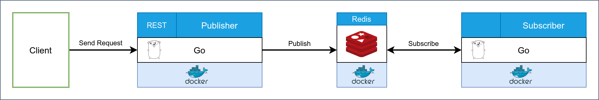
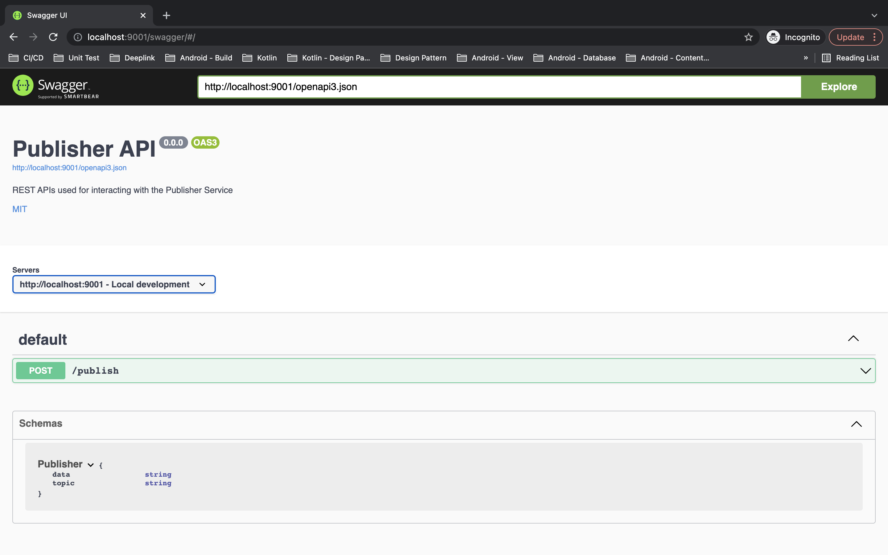

# Redis Pub/Sub Example
This project demonstrates the implementation publish-subscribe messaging pattern using [Redis](https://redis.io/) as message broker. The project contains code examples of publisher & subsciber service written in [Go](https://golang.org/) language.

## Contents
* [System Architecture](#system-architecture)
* [Getting Started](#getting-started)
  * [Prerequisites](#prerequisites)
  * [Installation](#installation)
* [Run](#run)

## System Architecture


## Getting Started
### Prerequisites
1.  Please make sure you have [Go](https://golang.org/doc/install) installed on your system.
2.  Please make sure you have [Docker](https://docs.docker.com/engine/install/) installed on your system.
3.  Please make sure you have [Docker Compose](https://docs.docker.com/compose/install/) installed on your system.

### Installation
1. Clone this repository to your local machine using terminal.
```bash
git clone https://github.com/mushoffa/redis-pubsub-go.git
```
2. Change the current working directory to the location of cloned directory.
```bash
cd redis-pubsub-go
```
3. Run the following command to run all the services in docker container.
```bash
make run
```

## Run
1. Run the following command to verify docker container is up and running.
```bash
$ docker ps
CONTAINER ID   IMAGE                        COMMAND                  CREATED          STATUS         PORTS                                       NAMES
a62b3a1a2205   redis-pubsub-go_publisher    "./publisher"            21 minutes ago   Up 1 second    0.0.0.0:9001->9001/tcp, :::9001->9001/tcp   go-publisher
13a50aa092ac   redis-pubsub-go_subscriber   "./subscriber"           21 minutes ago   Up 1 second                                                go-subscriber
4a72e095f7b7   redis:latest                 "docker-entrypoint.s…"   21 minutes ago   Up 2 seconds   0.0.0.0:6380->6379/tcp, :::6380->6379/tcp   redis-pubsub
```

2. Open [http://localhost:9001/swagger](http://localhost:9001/swagger) to send HTTP request using Swagger.


3. Run 'docker logs' on publisher, and subscriber to verify the message goes through redis and received on subsriber.
```bash
$ docker logs -f go-publisher
[GIN] 2021/11/17 - 17:29:34 | 200 |     358.299µs |      172.30.0.1 | POST     "/publish"
```

```bash
$ docker logs -f go-subscriber
Received message: publisher.test, Data: "test"
```
